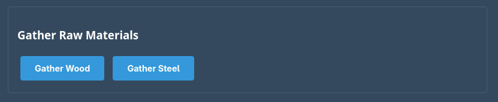
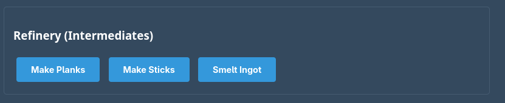
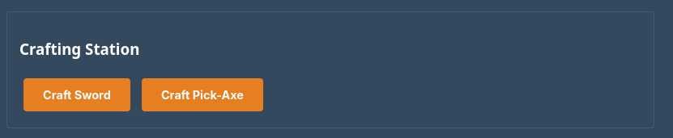
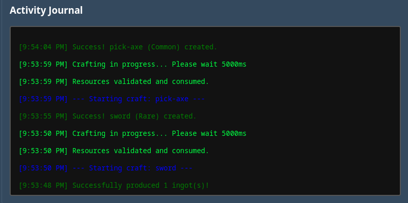

# Forge clicker game project
---
## About
### This was supposed to be a simple clicker game for school during our Javascript module, but I decided I wanted to add more so I did it with Javascript and Java, hope you enjoy the game.
### Disclaimer I did not do the styling of the website it was done with ai as I was more interested in doing the javascript and the back end.
### This site will not be hosted or put online, so I will provide instructions for running it.
---

## What I used for the project
- Languages
    -    
- Frameworks
    -  
- Build tools
    - 
    
- Developement
    - 

---
## How to run it
### Simple, after cloning or downloading the files you can run it on intelliJ or VScode after running it will be available on your localhost:8080 or whatever port your default is set to

## How to play
### It's a clicker game so you first gather wood and steel 

### then you move onto crafting planks, sticks and ingots

### and finally you make your tools

### and you monitor your item rarity and stock in the little console window

---
## Special thanks
### I would like to give a special thanks to [devilishlyney](https://github.com/devilishlyney) for emotional support 
